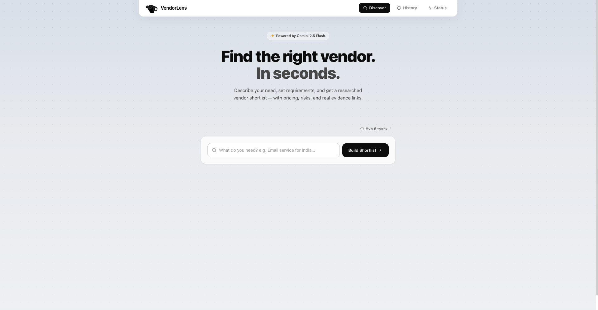
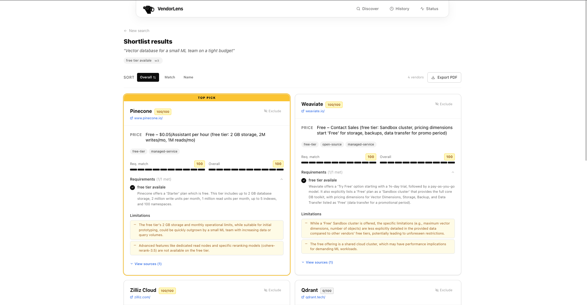
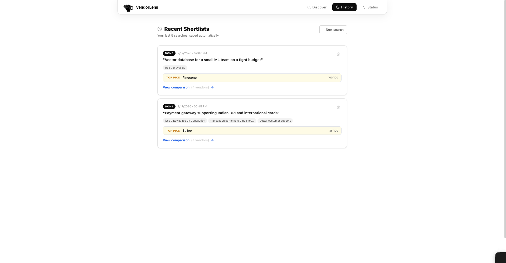

# VendorLens

A tool I built to solve something I kept running into — evaluating software vendors is a pain. You end up with 6 browser tabs open, half the pricing pages are behind a "contact sales" wall, and by the time you've gone through everything you've forgotten what you were comparing in the first place.

VendorLens automates that first research pass. Give it what you're looking for in plain English, set some weighted requirements, and it goes and researches 4 vendors for you — scraping their actual pricing and feature pages, running them through Gemini 2.5 Flash, and handing you a scored comparison with real evidence links and a list of risks.

---

## Screenshots

**Home — search form with weighted requirements**


**Results — scored comparison table with evidence links**


**History — last 5 shortlists**


---

## What it does

- Describe your need in plain English — "email delivery service for India with high deliverability"
- Add requirements and weight them 1–5 (so "GDPR compliant" can matter a lot more than "has a Slack integration")
- Optionally exclude vendors you've already ruled out before the search even runs
- It picks 4 vendors (with deliberate variety — not just the 4 obvious big names), scrapes their pages, and runs them through Gemini
- You get a scored comparison table — match %, price range, features, risks, evidence URLs
- Export a full PDF report you can actually send to someone
- Last 5 shortlists are saved automatically, re-open anytime
- Status page shows backend health, DB, and LLM connectivity

---

## Stack

| Layer     | Choice                              |
|-----------|-------------------------------------|
| Backend   | FastAPI + Python 3.11               |
| LLM       | Google Gemini 2.5 Flash             |
| Database  | SQLite via SQLAlchemy               |
| Scraping  | httpx + BeautifulSoup4              |
| Frontend  | React 18 + TypeScript + Vite        |
| Styling   | Tailwind CSS                        |
| Container | Docker + docker-compose             |

---

## Running it

Only thing you need is a Gemini API key (free at [aistudio.google.com](https://aistudio.google.com/app/apikey)).

```bash
git clone <repo-url>
cd VendorLens

cp .env.example .env
# open .env and paste your GEMINI_API_KEY

docker-compose up --build
```

That's it. Frontend is at **http://localhost:3000**, API docs at **http://localhost:8000/api/docs**.

The frontend waits for the backend health check to pass before starting, so no race condition on cold boot.

---

### Running without Docker (dev mode)

**Backend:**
```bash
cd backend
python -m venv venv && source venv/bin/activate   # Windows: venv\Scripts\activate
pip install -r requirements.txt

cp ../.env.example .env   # add your GEMINI_API_KEY

uvicorn app.main:app --reload --port 8000
```

**Frontend (separate terminal):**
```bash
cd frontend
npm install
npm run dev
```

Frontend at http://localhost:5173, backend at http://localhost:8000.

---

## Environment variables

| Variable              | Required | Default                           | Notes                                            |
|-----------------------|----------|-----------------------------------|--------------------------------------------------|
| `GEMINI_API_KEY`      | Yes      | —                                 | Main Gemini key                                  |
| `GEMINI_API_KEYS_RAW` | No       | —                                 | Comma-separated pool — backend rotates through them to handle rate limits |
| `GEMINI_MODEL`        | No       | `gemini-2.5-flash`                |                                                  |
| `DATABASE_URL`        | No       | `sqlite:///./data/vendorlens.db`  |                                                  |
| `CORS_ORIGINS_RAW`    | No       | `http://localhost:5173,...`       | Comma-separated list                             |

---

## API

| Method | Path                                 | Description                                   |
|--------|--------------------------------------|-----------------------------------------------|
| POST   | `/api/shortlist`                     | Create a shortlist (kicks off background task)|
| GET    | `/api/shortlist/{id}`                | Poll status / fetch result                    |
| GET    | `/api/shortlists`                    | Last 5 shortlists                             |
| POST   | `/api/shortlist/{id}/exclude-vendor` | Exclude a vendor from results                 |
| POST   | `/api/shortlist/{id}/include-vendor` | Re-include an excluded vendor                 |
| DELETE | `/api/shortlist/{id}`                | Delete a shortlist                            |
| GET    | `/api/health`                        | Backend + DB + LLM health                     |

Interactive Swagger UI at `/api/docs`.

---

## Project structure

```
VendorLens/
├── backend/
│   ├── app/
│   │   ├── main.py           # FastAPI app setup, CORS, startup
│   │   ├── config.py         # Settings via pydantic-settings + .env
│   │   ├── database.py       # SQLAlchemy ORM models + init_db
│   │   ├── models.py         # Pydantic request/response schemas
│   │   ├── routers/
│   │   │   ├── shortlist.py  # All shortlist endpoints + background processor
│   │   │   └── health.py     # /api/health
│   │   └── services/
│   │       ├── llm.py        # Two-phase Gemini pipeline (identify → scrape → compare)
│   │       └── scraper.py    # Async httpx + BeautifulSoup scraper
│   ├── requirements.txt
│   └── Dockerfile
├── frontend/
│   ├── src/
│   │   ├── api/client.ts     # Typed fetch wrapper for all API calls
│   │   ├── components/       # Header, ShortlistForm, ComparisonTable, VendorCard
│   │   ├── pages/            # Home, Results, History, Status
│   │   └── types/index.ts    # Shared TypeScript types
│   ├── public/
│   ├── package.json
│   ├── vite.config.ts
│   ├── nginx.conf
│   └── Dockerfile
├── docker-compose.yml
├── .env.example
├── ABOUTME.md
├── AI_NOTES.md
├── PROMPTS_USED.md
└── README.md
```

---

## What's working

- Two-phase LLM pipeline — Gemini first identifies vendors, then compares them using scraped data
- Async web scraping — targets pricing/feature sections specifically, falls back to full-page text
- Weighted requirements scoring — weights are factored into the final score calculation, not just labels
- Vendor variety — prompt explicitly avoids picking 4 from the same ecosystem; includes regional/niche alternatives when cost is a factor
- Pre-search exclusion — exclude vendors before the search, not just after
- Post-result exclude/include toggle — change your mind after seeing results
- PDF export — properly formatted report: scores, evidence, risk breakdown, recommendation
- History — last 5 shortlists auto-saved, re-openable, deletable
- Status page — live health check for backend, database, and LLM
- Mobile responsive — works properly on phone and tablet, not just "technically usable"
- Docker one-command setup — frontend waits for backend health before starting

## What's missing / known gaps

- No auth — shortlists aren't tied to users, so anyone with the URL can see them
- JS-heavy SPAs won't scrape well — falls back to what Gemini already knows, which is usually fine
- SQLite for now needs Postgres for production
- No automated tests — didn't have time to write them properly

---

Takes about 20–40 seconds per shortlist depending on how cooperative the vendor pages are. The scraping is the slow part.
